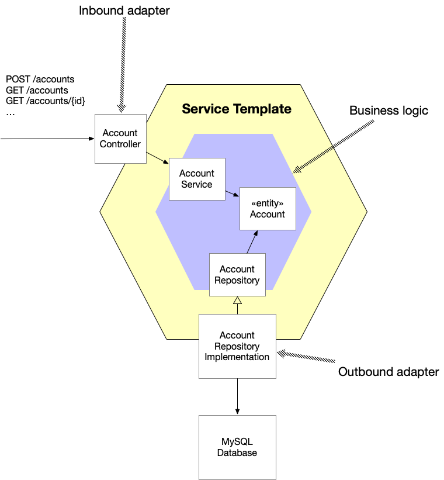

= About the service template

This project is a https://microservices.io/patterns/service-template.html[Service Template].

== Service template architecture

The service template has an https://livebook.manning.com/book/microservices-patterns/chapter-2/35[hexagonal architecture].
It consists of the core business logic and multiple adapters, which communicate with the world outside of the service.

The hexagonal architecture has certain advantages over the more common layered architecture.
Most notably, the outbound adapters depend on the business logic rather than vice versa.
Also, adapters can be tested independently of one another, which simplifies testing.

The service template's sample business logic consists of the `AccountService`, the `Account` JPA `@Entity` and the `AccountRepository`.

There are two types of adapters:

* inbound adapters - handle inbound requests, such as HTTP requests, and invoke the business logic.
The service template has one sample inbound adapter: `AccountController`, which implements an API for creating and updating `Accounts`.

* outbound adapters - make outbound requests, such as database calls, and are invoked by the business logic.
The service template has one sample outbound adapter, which is the implementation of  `AccountRepository` that's generated by Spring Data JPA.

== Gradle project structure

The Gradle project consists of the following key sub-projects:

* `service-template-domain` - implements the business logic
* `service-template-web` - inbound adapter that implements the Web API
* `service-template-persistence` - outbound adapter that implements persistence using JPA
* `service-template-main` - the contains the service template's main class

There are also the following supporting sub-projects:

* `service-template-config` - contains the service's `application.properties`
* `service-template-util` - defines utility classes
* `service-template-test-*` - test support modules

== Test organization

The tests are organized into the following Gradle source sets:

* `src/test` - fast running unit tests that execute entirely in memory. You can, for example, run these with `./gradlew test`.
* `src/integrationTest` - slower integration tests that typical involve containerized infrastructure services, such as a database. You can, for example, run these with `./gradlew integrationTest`.
* `src/componentTest` - even slower tests that verify the behavior of service template packaged as a Docker container.

Note: you can run tests selectively, e.g. `./gradlew :service-template-main:integrationTest --tests '*ServiceTemplateApplicationSecurityTests'` runs the specified integration test in the `service-template-main` sub-project.
